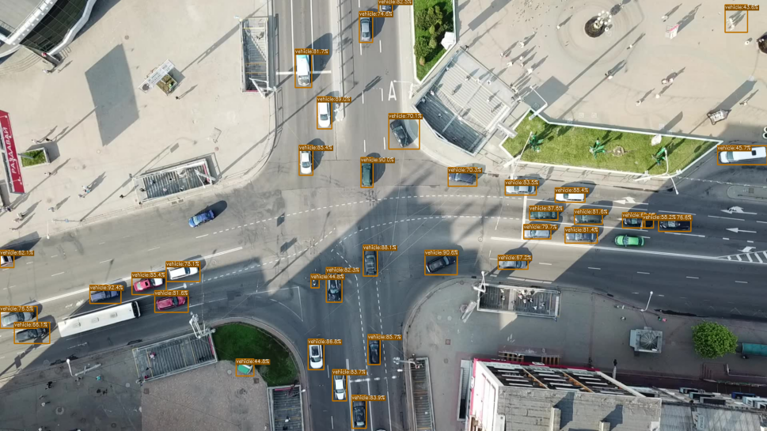

# Starter Template for Object Detection Training/Validation Pipeline

## Table of Contents
1. [Introduction](#intro)
2. [Requirements and Installation](#installation)
3. [Data](#data)
4. [Training](#training)
5. [Inference](#inference)
6. [Deployment](#deployment)

## Introduction  <a name="intro"></a>
This repository contains training, validation, and inference code for object detection using the (YOLOX)[https://github.com/Megvii-BaseDetection/YOLOX] model. "YOLOX is an anchor-free version of YOLO, with a simpler design but better performance! It aims to bridge the gap between research and industrial communities.
For more details, please refer to our [report on Arxiv](https://arxiv.org/abs/2107.08430)."

The PyTorch Lightning 2.x framework is used as a wrapper for the YOLOX model to enable reproducible training and validation, advanced metric logging, and overall flexibility and transparency during the training process. This repository is designed to be extensible; allowing object detection training on custom datasets with configurable network architectures.

Addition utilities in this repos:
- Ability to convert weights to ONNX, TensorRT, and OpenVINO format



## Requirements and Installation <a name="installation"></a>
Clone the repository into your working directory and install the dependencies.

```shell
git clone <repo_link>
cd <dir>
pip install -r requirements.txt # or pip install -v -e .
```

Download weights pretrained on COCO2017 for each YOLOX architecture from [the original YOLOX repository](https://github.com/Megvii-BaseDetection/YOLOX) and put them in `/weights/pretrained_weights/`.

Verify correct lightning, pytorch, and other dependency installation by running `python3 main.py fit --config config.yaml --print_config`

## Data <a name="data"></a>

YOLOX can be trained for custom object detection tasks if labeled data is provided.

Data should be separated into image and label directories. For example, the dataset for thermal building detection has the following generic structure
```
image_dir/
    image1.png
    image2.png
    ...
label_dir/
    image1.txt
    image2.txt
    ...
```

__ATTENTION: Make sure that the albumentations bounding box transformations matches the format of the bounding boxes within the label files (i.e. yolo, albumentations, coco, or pascal_voc). See [this link](https://albumentations.ai/docs/getting_started/bounding_boxes_augmentation/) for clarification.__

Since most of the logic for loading images and labels is similar across different dataset types, it's recommended for the user to refer to the [thermal building dataset](./data/thermal_building_dataset.py) or [uav vehicle detection dataset](./data/uav_vehicle.py) to use as a template for structuring the logic within future dataset classes or data loading operations.

Note that the INRIA EO Building Detection dataset has a different structure so it requires custom logic when writing its Dataset class.

### Data Augmentations
Data augmentations are defined in the constructor of the [lightning data module](./data/detection_data_module.py). Change them as necessary here. They will be saved during training with the best set of weights and tensorboard metrics.

## Training <a name="training"></a>

Read the tutorial for training on custom datasets [here](./docs/train_custom_data.md)

This repo uses the Lightning CLI to maintain a high level of abstraction during model training and finetuning. All of the training hyperparameters are configurable from `config.yaml`. See the [Lightning Docs](https://lightning.ai/docs/pytorch/latest/common/trainer.html#trainer-class-api) on more information about the various hooks, flags, and callbacks available in Lightning.

Training can be started with this command.
```shell
python3 main.py fit --config config.yaml # ./run_train.sh
```

## Inference <a name="inference"></a>
```shell
python3 demo.py --mode dir --image_dir /path/to/images/ --ckpt /path/to/lightning/weights --conf 0.3 --nms 0.4
```

This command will do the following:
1. Load the weights for YOLOX specified by `ckpt`
2. Iterate through all of the images from `image_dir`
3. Perform bounding box/class prediction on each image
4. Draw bounding boxes on each image if there is a detection within the confidence and nms threshold
5. Save the images with bounding boxes draw in folder called `vis_results/` in the same parent directory provided by `ckpt`.


## Deployment <a name="deployment"></a>

After weights are converted to `onnx`, rename them with the following convention `<architecture>_<purpose>.onnx` and place them in `weights/` for evaluation.

## Coming soon
- [x] Log the loss functions during validation
- [x] Compute and log average and mean average precision during training and validation.
- [x] Inference function (numpy input, numpy output with bounding boxes and labels draw).
- [x] Visualize data augmentations from within the lightning data module (should be specifiable from `config.yaml`)
- [x] Ability to specify `yolox_custom` width/depth.
- [ ] Ability to have warmup epochs right before training
- [x] Move model creation outside of `lit_yolox.py`
- [x] Moved data augmentation creation within DroneNetDataModule
- [ ] Implement `predict` subcommand in Lightning CLI
- [ ] Implement `BasePredictionWriter` as alternative to using `demo.py`
- [x] Verify onnx conversion and correct inference within the new Lightning YOLOX framework
- [x] Completed README and tutorials for how to train with new data
- [x] Implement YOLOX C++ postprocessing
- [ ] Resetting optimizer/learning rate scheduler states after loading a checkpoint in Lightning CLI
- [ ] Mosaic augmentations??
- [ ] Further error checking as needed
- [ ] Add EMA capability
- [ ] Add distributed parallel training capability (DDP)
- [x] Refactor Dataset classes to remove unnecessary outputs from `__getitem__()`
- [x] Add scripts and Dockerfile in separate folder to allow easy conversion to DLC


## Authors
The YOLOX architecture was created by its original authors. This Python wrapper repo was developed and maintained by Bassam Bikdash. For any inquiries or support, please contact Bassam Bikdash at bbikdash@gmail.com.


##### Author: Bassam Bikdash, 2023
##### Maintainer: Bassam Bikdash, 2023
##### Contact: bbikdash@gmail.com
